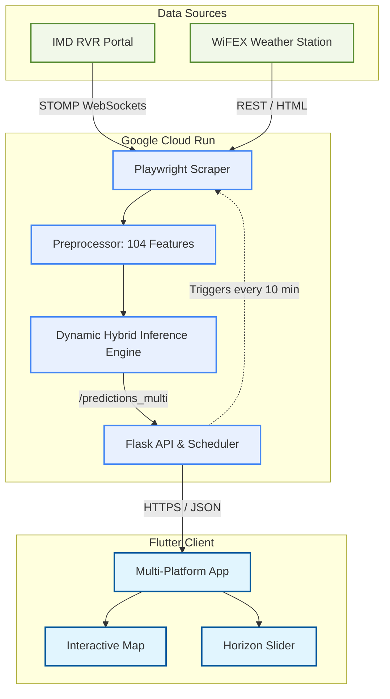
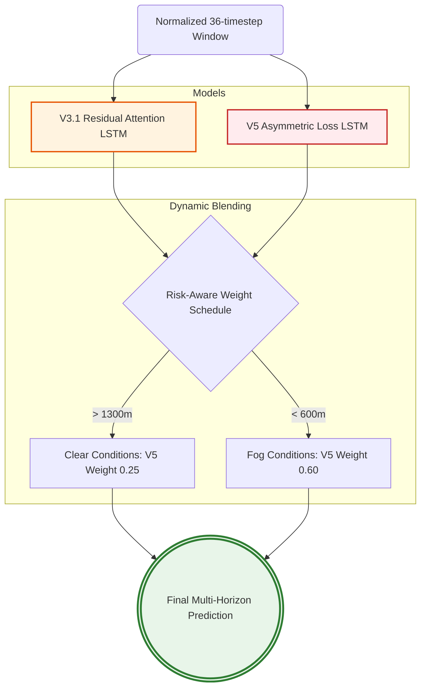
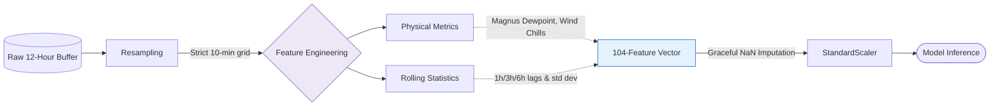
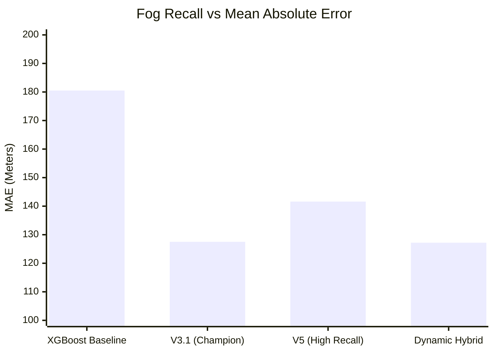

# Recommended Images and Diagrams for Internship Report

Here is a curated list of diagrams and images that perfectly illustrate the technical depth of your project. You can copy this code into an online renderer like [Mermaid Live](https://mermaid.live/) or screenshot them directly if your Markdown viewer supports Mermaid!

## 1. High-Level System Architecture
*This diagram illustrates the end-to-end flow of data from the sensor networks to the Google Cloud backend, and finally to the Flutter clients used by ATC.*

---

## 2. Dynamic Hybrid Ensemble Logic (Model Architecture)
*This diagram highlights your major machine learning contribution: combining the high-accuracy V3.1 model with the safety-first V5 model.*

---

## 3. Real-Time Data Pipeline
*This flowchart breaks down the complex data preprocessing steps required to feed the models, perfect for the "Implementation" section of your report.*

---

## 4. Model Benchmarking Comparison
*A visual representation of how your models perform compared to the baseline. (You can also easily recreate this as a bar chart in Excel/Word).*

*(Note: The bar represents MAE (lower is better), and the line represents Fog Recall percentage (higher is better)).*

---

## 5. Required Application Screenshots (To take manually)

Since your project includes a Flutter frontend, I highly recommend capturing the following actual screenshots from your running app to put into Chapter 2:
1. **The Main Map View (Light Mode)**: Showing the OpenStreetMap topography and the 10 runway ICAO markers.
2. **The Main Map View (Dark Mode)**: Demonstrating the theme-aware premium aesthetics (CartoDB Dark).
3. **The Horizon Slider**: An action shot showing the bottom control panel (transparent) with the slider shifted to "+3h".
4. **The Auto-Recenter Feature**: A screenshot showing the map panned away with the auto-recenter target icon visible.
5. **The Application Logo**: The `flutter_app/assets/RVR_logo.png` file, which you can use in the introduction or cover page of your report.
