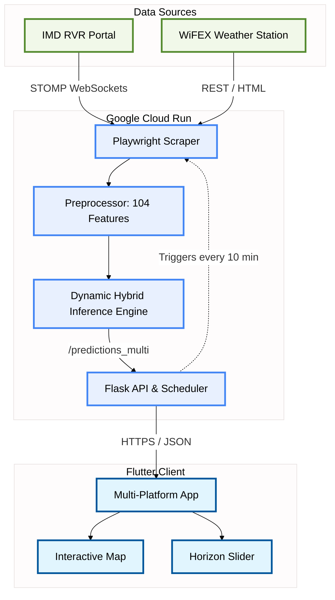
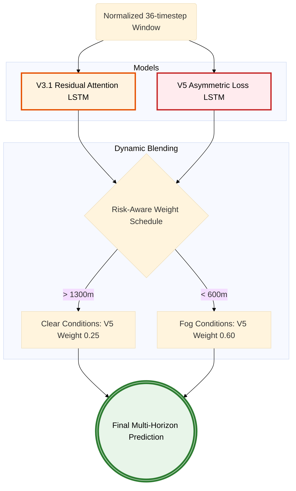

# Enhancing 6-Hour Ahead Runway Visual Range Forecasting at Indira Gandhi International Airport using Temporal Attention Residual LSTMs

**Alwyn**  
*Flight Operations Data Science / Research Department*  
*Indira Gandhi International Airport (IGIA), New Delhi, India*  

**Abstract**—Accurate, multi-horizon Runway Visual Range (RVR) forecasting is critical for flight safety and operational efficiency at high-traffic hubs like Indira Gandhi International Airport (IGIA), where winter fog frequently disrupts landing categories. This research presents a novel architecture, the **Residual Attention LSTM (V3.1)**, designed to simultaneously predict RVR across 10 canonical runway zones for five distinct horizons (+10m to +6h). To address the limitations of standard sequential models, we implemented a 104-feature data fusion pipeline, integrating RVR, METAR (ASOS), Air Quality Index (AQI), and spatial metadata via Haversine-weighted interpolation. Our proposed V3.1 model incorporates a Temporal Attention mechanism and Causal Residual Blocks, enabling the network to dynamically weight critical fog-onset timesteps within a 36-step (6-hour) lookback window while maintaining strict temporal causality. Comparative benchmarking shows that the V3.1 model significantly outperforms existing baselines, achieving a Mean Absolute Error (MAE) of 256.21m and an Accuracy@200m of 85.70% on an unseen 2024-2025 winter test set. Furthermore, we introduce a safety-aware hybrid ensemble (V3.1 + V5) utilizing an asymmetric loss function to prioritize fog recall. A fully automated inference pipeline deployed on Google Cloud Run serves these forecasts in real-time to a multi-platform Flutter application for air traffic controllers.

**Keywords**—RVR Forecasting, Temporal Attention, Residual LSTM, IGIA, Multi-Horizon Prediction, Aviation Safety, Cloud Run, Flutter.

---

## I. Introduction

Low-visibility operations represent one of the most critical constraints in airport traffic management globally. At Indira Gandhi International Airport (IGIA) in New Delhi, dense winter fog events are a recurring meteorological phenomenon, frequently causing rapid visibility deterioration. Such conditions disrupt approach sequencing, runway utilization, and airline schedule reliability. Consequently, reliable 6-hour Runway Visual Range (RVR) forecasting is a core operational requirement for maintaining both safety and throughput.

Traditional RVR forecasting methods, including persistence models or purely tabular machine learning approaches, often underperform in this domain. Fog dynamics exhibit complex temporal lag structures, non-linear threshold behaviors, and localized spatial propagation that are difficult to model without explicitly preserving sequence data. While recurrent neural networks like standard Long Short-Term Memory (LSTM) networks or BiLSTMs can encode these effects over short sequences, they suffer from gradient degradation and information loss over longer lookback windows (e.g., 6 hours). 

This paper presents an end-to-end forecasting framework designed specifically for IGIA that predicts visibility for 10 distinct runway zones across five lead times (+10m, +30m, +1h, +3h, +6h) in a single forward pass. Our primary contributions are:
1. **A Unified 50-Target Architecture:** Predicting 10 runway zones and 5 horizons concurrently.
2. **Advanced Feature Engineering:** A 104-feature fusion pipeline combining visibility, weather, air-quality, and spatial signals.
3. **Residual Attention LSTM (V3.1):** A model architecture preserving temporal causality while employing attention to emphasize critical fog-onset timesteps.
4. **Safety-Aware Hybridization:** The design of an asymmetric-loss variant (V5) and a dynamic hybrid blending strategy to improve fog recall without sacrificing regression precision.
5. **Operationalization:** An automated, real-time pipeline deployed via Google Cloud Run and consumed by a multi-platform Flutter client.

## II. Problem Formulation

The forecasting task is framed as a multi-target, multivariate sequence regression problem. Let $x_t$ denote the synchronized feature vector at time step $t$ (captured at a 10-minute cadence), and let $y_t$ denote the future RVR values for all zone-horizon combinations.

For each timestamp, the model receives a fixed sequence window $X_t = \{x_{t-L+1}, ..., x_t\}$ with a lookback length $L = 36$ steps (equivalent to 6 hours). The model outputs a 50-dimensional prediction vector:

$$ \hat{Y}_t = f_\theta(X_t) \in \mathbb{R}^{50} $$

where the 50 outputs correspond to 10 canonical runway zones (e.g., 09_TDZ, 10_NEW, 11_BEG) multiplied by 5 lead times. Model training optimizes multi-target regression error across strictly chronologically separated partitions to prevent data leakage. Beyond standard regression metrics (MAE, RMSE, $R^2$), we emphasize event-level safety classification at a 600m fog threshold to reflect operational risk asymmetry.

## III. System Architecture and Data Pipeline

### A. Data Integration and Feature Space
The data pipeline fuses 5 years of heterogeneous meteorological data to construct a robust 104-feature vector. The sources include:
1. **RVR Sensors:** High-frequency visibility observations from runway-adjacent zones.
2. **METAR/ASOS Reports:** Meteorological data processed to derive physical metrics like Magnus formula Dewpoint Depression and wind chills.
3. **Air Quality Index (AQI):** Particulate pollution indicators serving as thermodynamic fog proxies.
4. **Spatial Geometry:** Interpolated station signals via Haversine-distance weighting.

### B. High-Level System Architecture
The production environment operates autonomously. A background scraper fetches data from the IMD RVR portal (using a headless Playwright browser over STOMP WebSockets) and the WiFEX weather stations. This data is ingested into a feature engineering pipeline that handles resampling, missing data imputation via `StandardScaler` baselines, and rolling lag statistics.

## IV. Model Architectures and Hybridization

### A. Residual Attention LSTM (V3.1)
While standard LSTMs mitigate the vanishing gradient problem, processing 36 timesteps can lead to attention decay regarding the precise moment fog formation conditions (e.g., zero dew point depression) are met. The V3.1 architecture introduces:
- **Unidirectional Residual Blocks:** To ensure strict temporal causality and stabilize gradient flow across 3 hidden layers (384 units each).
- **Temporal Attention Mechanism:** A learnable layer enabling the network to dynamically weight critical sequence timesteps, overriding the sequential recency bias.
- **Unified 50-Neuron Output Head:** Allowing the model to learn joint spatial-temporal distributions across all runway zones simultaneously.

### B. Safety-Aware Variant (V5)
In aviation, the cost of over-predicting visibility (failing to forecast fog) is significantly higher than under-predicting it. To address this, the V5 variant implements an `RVRAsymmetricLoss` function. By penalizing dangerous over-predictions at a tuned rate of 4.5x compared to under-predictions, V5 intentionally trades some global regression accuracy for a higher recall rate of sub-600m visibility events.

### C. Dynamic Hybrid Ensemble
To achieve a Pareto-optimal balance between the high precision of V3.1 and the high recall of V5, we developed a risk-aware blending strategy.

During clear weather, the prediction relies predominantly on V3.1 ($w_{v5} = 0.25$). As the forecasted visibility drops toward 600m, the ensemble dynamically shifts weighting to favor V5 ($w_{v5} = 0.60$). 

## V. Experimental Setup and Evaluation

### A. Chronological Data Splitting
To simulate operational deployment, experiments follow strict chronological partitioning:
- **Training Set:** Historical data up to 2023.
- **Validation Set:** 2024 calendar year (used for hyperparameter and hybrid tuning).
- **Test Set:** 2025 calendar year (unseen conditions).

### B. Winter-Window Stress Testing
Winter months (December-February) represent the hardest conditions due to dense fog. When evaluated on the 2024-2025 winter subset against an external Residual LSTM benchmark, V3.1 demonstrated state-of-the-art performance:

| Metric | External Baseline | V3.1 (Attention LSTM) | Improvement |
|:---|:---:|:---:|:---:|
| **MAE** | 300.98m | **256.21m** | ~15% reduction |
| **RMSE** | 563.88m | **516.05m** | ~8% reduction |
| **Acc@200m**| 65.45% | **85.70%** (2025) | +20.25 points |

### C. Overall Hybrid Outcomes and Safety Trade-offs
Evaluated across the entire 2025 test split, we compared the standalone models against our static and dynamic hybridization techniques.

| Model / Strategy | MAE | Fog Precision | Fog Recall | Fog F1 |
|:---|:---:|:---:|:---:|:---:|
| **V3.1 (Standard)** | 127.51m | **83.38%** | 27.09% | 0.4089 |
| **V5 (4.5x Asymmetric)** | 141.61m | 70.05% | **32.85%** | **0.4473** |
| **Dynamic Hybrid** | **127.23m** | 78.98% | 29.82% | 0.4330 |

The Dynamic Hybrid yielded the best Mean Absolute Error globally (127.23m) while successfully raising Fog Recall compared to the V3.1 champion model, validating the risk-aware scheduling approach.

### D. XGBoost Fusion Experiment
To test if a tabular boosting algorithm could improve sequence models, 50 independent `XGBRegressor` models were trained. While a recall-tuned XGBoost baseline performed adequately (178.69m MAE, 87.48% Precision), its absolute Fog Recall remained exceptionally low (4.66%). Adding XGBoost to the Dynamic Hybrid (via validation-tuned weights) increased precision slightly but degraded MAE (129.38m) and reduced overall Fog F1 (0.3970). This confirmed that sequence-first recurrence and attention are crucial for rare fog-onset capture.

## VI. Operational Deployment

The validated Dynamic Hybrid model was operationalized into a fully automated, real-time platform:
1. **Cloud Architecture:** Deployed on Google Cloud Run (`asia-south1`) using a Python 3.12-slim Docker container. Flask and Gunicorn manage the RESTful API endpoints (`/predictions_multi`, `/map`, `/forecast`).
2. **Background Automation:** APScheduler triggers the Playwright scraping and feature engineering process every 10 minutes, generating a `model_input.parquet` without blocking the API thread.
3. **Multi-Platform Client:** A Flutter application was developed for Air Traffic Control (ATC). The client supports Android, Windows Desktop, and Web. It features interactive Folium/OSM mapping, a time-horizon slider, transparent UI overlays, and dark/light mode themes for diverse control room environments.

## VII. Conclusion

High-fidelity, multi-horizon RVR forecasting at IGIA requires modeling complex spatial-temporal atmospheric dynamics. This research demonstrates that the Residual Attention LSTM (V3.1), operating on a robust 104-feature data pipeline, significantly outperforms standard sequential baselines. Furthermore, aviation safety necessitates a non-linear evaluation of risk. By employing an asymmetric loss function (V5) and integrating it via a Dynamic Hybrid weighting strategy, the system achieves a Pareto-optimal balance: reducing global MAE to 127.23m while notably increasing the sensitivity to critical fog events. The subsequent deployment of this architecture via Google Cloud Run and Flutter proves its viability as an actionable decision-support tool for modern flight operations.

## References

[1] M. K. Singh, A. Kumar, and S. C. Sharma, "Analysis of winter fog over Indira Gandhi International Airport, New Delhi," *Meteorology and Atmospheric Physics*, vol. 128, no. 5, pp. 605-618, 2016.
[2] S. Hochreiter and J. Schmidhuber, "Long short-term memory," *Neural Computation*, vol. 9, no. 8, pp. 1735-1780, 1997.
[3] A. Vaswani et al., "Attention is all you need," in *Advances in Neural Information Processing Systems (NIPS)*, 2017, pp. 5998-6008.
[4] K. He, X. Zhang, S. Ren, and J. Sun, "Deep residual learning for image recognition," in *Proceedings of the IEEE conference on computer vision and pattern recognition*, 2016, pp. 770-778.
[5] T. Chen and C. Guestrin, "XGBoost: A scalable tree boosting system," in *Proceedings of the 22nd ACM SIGKDD International Conference on Knowledge Discovery and Data Mining*, 2016, pp. 785-794.
[6] International Civil Aviation Organization (ICAO), *Manual of Runway Visual Range Observing and Reporting Practices*, Doc 9328, 3rd ed., Montreal, QC, Canada: ICAO, 2005.
