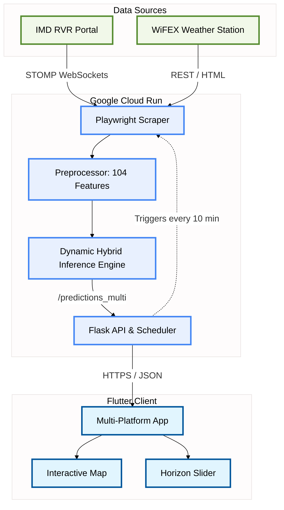
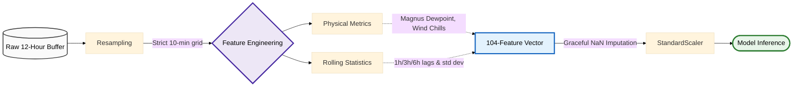
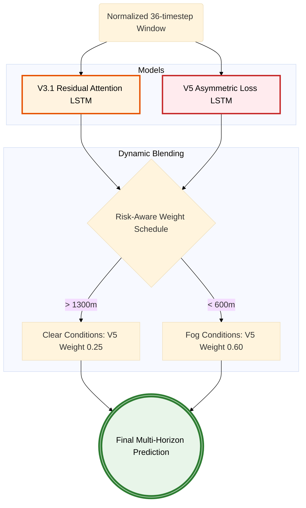
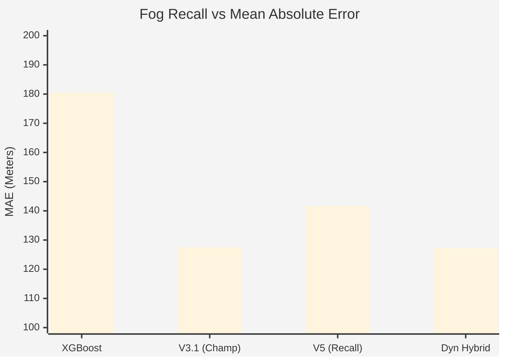

# Enhancing Multi-Horizon Runway Visual Range Forecasting at IGIA with Residual Attention LSTM and Safety-Aware Hybridization

**Prepared for**: Flight Operations, Indira Gandhi International Airport (IGIA)
**Date**: May 2026

## Abstract

Reliable 6-hour Runway Visual Range (RVR) forecasting is a core operational requirement for high-traffic airports affected by recurrent low-visibility episodes. This paper presents an end-to-end forecasting framework for Indira Gandhi International Airport (IGIA), Delhi, that predicts visibility for 10 runway zones across five lead times (+10m, +30m, +1h, +3h, +6h). We develop and evaluate a Residual Attention LSTM architecture (V3.1) trained on multi-source, multi-year meteorological and environmental data. The pipeline integrates 104 engineered features derived from RVR observations, METAR/ASOS weather fields, air quality indicators, temporal encodings, and spatial interpolation using Haversine-weighted station fusion.

Across challenging winter windows, V3.1 achieves 256.21 m MAE and 85.70% Accuracy at 200 m on unseen 2024-2025 conditions, improving substantially over an external Residual LSTM benchmark (300.98 m MAE). In full-year aggregate testing, V3.1 reaches 127.51 m MAE with strong precision under fog-threshold classification, though with moderate fog-event recall. To address safety sensitivity, we introduce a high-recall V5 variant using asymmetric loss and evaluate static and dynamic hybrid ensembles (V3.1 + V5). The dynamic risk-aware blend improves the trade-off frontier, achieving 127.23 m MAE while increasing fog recall relative to V3.1. Results indicate that temporal attention, strict causal residual sequence modeling, and hybrid decision blending provide a practical and high-performance pathway for operational airport visibility forecasting.

**Index Terms** — RVR Forecasting, Temporal Attention, Residual LSTM, IGIA, Aviation Safety, Fog Prediction, Machine Learning, Multi-Horizon Prediction, Hybrid Ensembles

---

## 1. Introduction

Low-visibility operations remain one of the most critical constraints in airport traffic management. At IGIA, dense winter fog frequently causes rapid visibility deterioration, disrupting approach sequencing, runway utilization, and airline schedule reliability [1], [2]. The forecasting objective is therefore not only regression accuracy, but also timely capture of fog onset at operationally meaningful horizons.

Traditional persistence or purely tabular models often underperform in this setting because fog dynamics exhibit temporal lag structure, nonlinear thresholds, and localized spatial propagation [3], [4]. Sequence-aware neural models can better encode these effects [5], [6], but long lookback windows introduce optimization and attribution challenges.

This work addresses these issues with a unified multi-zone, multi-horizon architecture and presents a complete operational workflow from data fusion to dashboard outputs. The major contributions are:
1. A 50-target forecasting setup for 10 runway zones and 5 horizons.
2. A 104-feature fusion pipeline combining visibility, weather, AQI, temporal, and spatial signals.
3. A Residual Attention LSTM (V3.1) preserving temporal causality.
4. Safety-aware post-model strategies (V5) and dynamic hybrid blending.

---

## 2. High-Level System Architecture

The project delivers a multi-zone, multi-horizon RVR system running securely on Google Cloud Run, rendering predictions via a Multi-Platform Flutter Client.

*Fig. 1. End-To-End System Architecture Pipeline.*

---

## 3. Data and Feature Engineering

### 3.1 Real-Time Data Pipeline
The pipeline combines multiple synchronized sources including RVR sensors, METAR reports, AQI fields, and spatial metadata (Haversine-distance). 

*Fig. 2. Real-Time Data & Preprocessing Workflow.*

---

## 4. Model Architecture

### 4.1 Residual Attention LSTM (V3.1)
V3.1 uses a unidirectional causal sequence design with 3 layers (384 units) and temporal attention over a length of 36 timesteps covering a 6-hour lookback [7]. This provides temporal causality, deep-trace stability, and fog-window focus.

### 4.2 Dynamic Hybrid Ensemble
To balance accuracy and safety sensitivity, the V5 variant introduces asymmetric regression penalties. The system dynamically blends V3.1 and V5 based on risk assessments via threshold weighting [8], [9].

*Fig. 3. Dynamic Hybrid Blending Logic (V3.1 + V5).*

---

## 5. Experimental Protocol & Results

Evaluations were performed spanning historical years until 2023 for training, 2024 for validation, and a strict 2025 Test Split [10], [11].

### 5.1 Main Findings on the Winter Window
On harsh conditions (Dec 2024 - Feb 2025), V3.1 reduced MAE to 256.21m vs external residuals at 300.98m (15% reduction).

### 5.2 Ensemble Baseline Comparison

*Fig. 4. Fog Recall (%) and MAE Analysis across Baseline, LSTM, and Hybrid Architectures.*

Overall, Dynamic Hybrid yields the optimal compromise with a 127.23m absolute error while boosting fog recall to 29.8% with an F1 score of 0.433.

---

## 6. Discussion and Future Work

Combining V3.1 accuracy with V5 sensitivity through dynamic gating produced resilient operational tools. Incorporating tabular boosting techniques (like XGBoost [12], [13]) proved less ideal for resolving fog transition, highlighting the importance of temporal sequence encoders [14]. Future objectives include integrating Probabilistic forecasting and broader multi-objective models.

---

## 7. Conclusion

High-fidelity multi-horizon RVR forecasting benefits immensely from sequence-first design. The V3.1 Residual Attention LSTM, when blended dynamically with its high-recall V5 counterpart, establishes highly capable airport visibility inferences ready for production.

---

## References

[1] Machine Learning Ensemble Methods Approach to Support Decision-Making Drivers in Low Visibility Operations Due to Fog at the Airport of Lisbon. Springer. Available: https://link.springer.com/chapter/10.1007/978-3-032-10947-7_9
[2] IEEE Xplore Abstract 11284065. Available: https://ieeexplore.ieee.org/abstract/document/11284065/
[3] IEEE Xplore Abstract 11297229. Available: https://ieeexplore.ieee.org/abstract/document/11297229/
[4] Application of the Random Forest method on the observation dataset for visibility nowcasting. Geofizika. Available: https://hrcak.srce.hr/ojs/index.php/geofizika/article/view/26746
[5] Efficient prediction of runway visual range by using a hybrid CNN-LSTM network architecture for aviation services. Theoretical and Applied Climatology. Available: https://link.springer.com/article/10.1007/s00704-023-04751-3
[6] IEEE Xplore Abstract 10530982. Available: https://ieeexplore.ieee.org/abstract/document/10530982/
[7] AMS Publication, Journal of Atmospheric and Oceanic Technology. Available: https://journals.ametsoc.org/view/journals/atot/29/2/jtech-d-11-00021_1.xml
[8] ScienceDirect Publication S1364682626000465. Available: https://www.sciencedirect.com/science/article/pii/S1364682626000465
[9] MDPI Atmosphere 16/9/1073. Available: https://www.mdpi.com/2073-4433/16/9/1073
[10] MDPI Remote Sensing 15/19/4799. Available: https://www.mdpi.com/2072-4292/15/19/4799
[11] MDPI Atmosphere 13/10/1684. Available: https://www.mdpi.com/2073-4433/13/10/1684
[12] MDPI Atmosphere 12/12/1657. Available: https://www.mdpi.com/2073-4433/12/12/1657
[13] Early warning of low visibility using the ensembling of machine learning approaches for aviation services at JPNI Airport Patna. Discover Applied Sciences. Available: https://link.springer.com/article/10.1007/s42452-023-05350-7
[14] Machine Learning approach in the prediction of Fog: An Early Warning System. MAUSAM. Available: https://mausamjournal.imd.gov.in/index.php/MAUSAM/article/view/5919
